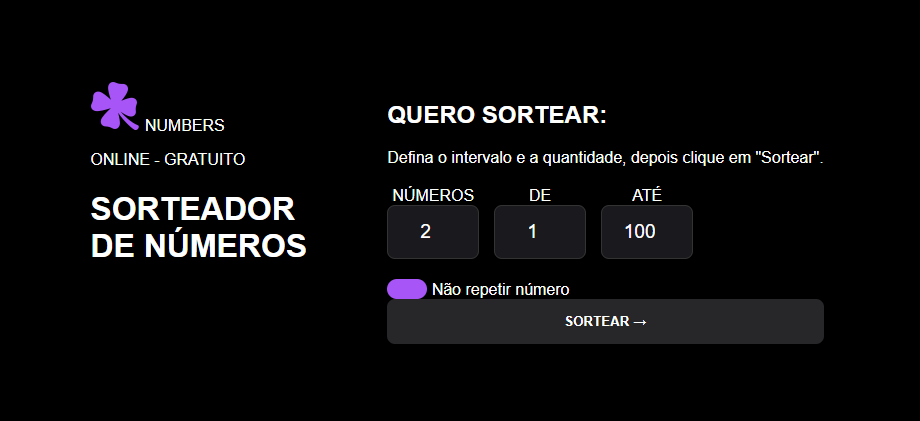

# 🎰 Projeto: Sorteador de Números

## 📝 Introdução
* **Nome do projeto:** Sorteador de Números 🔢
* **Contexto:** Desenvolvido como um desafio prático para consolidar fundamentos de **Lógica de Programação** e manipulação dinâmica de interfaces web.
* **Objetivo:** Oferecer uma ferramenta simples onde o usuário define uma quantidade de números e um intervalo, recebendo um resultado aleatório e sem repetições.
* **Motivação:** O projeto marca a transição entre o código estático e o **código interativo**, sendo um excelente exercício para entender como o JavaScript "conversa" com o HTML e o CSS. 💡

---

## ⚙️ Principais Funcionalidades
* **Configuração Personalizada:** O usuário escolhe quantos números quer, o valor mínimo e o valor máximo. 🛠️
* **Sorteio Inteligente:** Garante que os números não se repitam no mesmo sorteio (lógica de verificação em listas). ✅
* **Interface Reativa:** Exibe os resultados na tela instantaneamente após o clique.
* **Botão Reiniciar:** Permite limpar todos os campos e estados do jogo com um único clique, resetando a experiência. 🔄

---

## 🛠️ Tecnologias Utilizadas
* **HTML5:** Estruturação dos formulários, botões e da seção de resultados. 🏗️
* **CSS3:** Design moderno e organização do layout (estilo card). 🎨
* **JavaScript:**
    * `Math.random()` para gerar a aleatoriedade. 🎲
    * **Manipulação de DOM** para ler inputs e escrever os resultados na tela. 🖱️
    * **Arrays:** Para armazenar e validar os números sorteados. 📊

---

## 🖼️ Aparência e Interação

---

## 🧠 Lições Aprendidas
* **Loops e Condicionais:** Uso de `while` ou `for` para repetir o sorteio até atingir a quantidade desejada. 🔄
* **Validação de Dados:** Entender que a lógica deve impedir erros (ex: tentar sortear 5 números em um intervalo de apenas 2). ⚠️
* **Escopo de Funções:** Organização do código em funções específicas para cada tarefa (sortear, reiniciar, alterar status do botão). 📂

---

## 🏁 Conclusão
Este projeto foi uma experiência fundamental para dominar a **interatividade no Front-end**. O maior desafio foi garantir que a lógica de "não repetição" funcionasse perfeitamente, e o resultado final traz a satisfação de ver a lógica pura se transformando em uma ferramenta útil e visualmente agradável. 🏆✨
